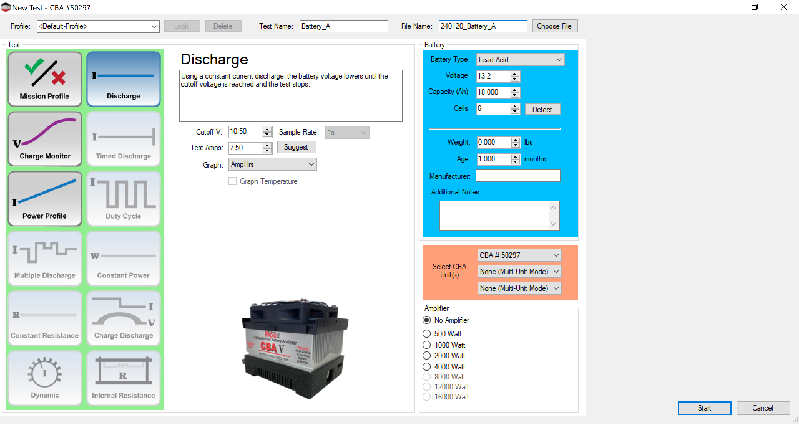
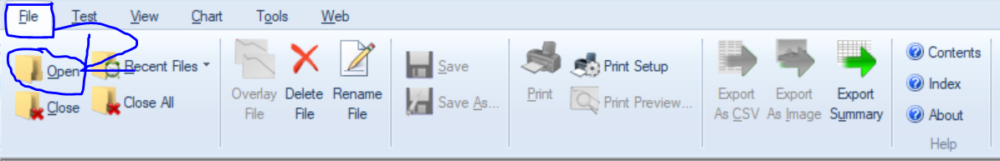
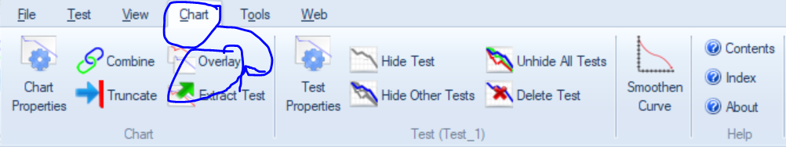
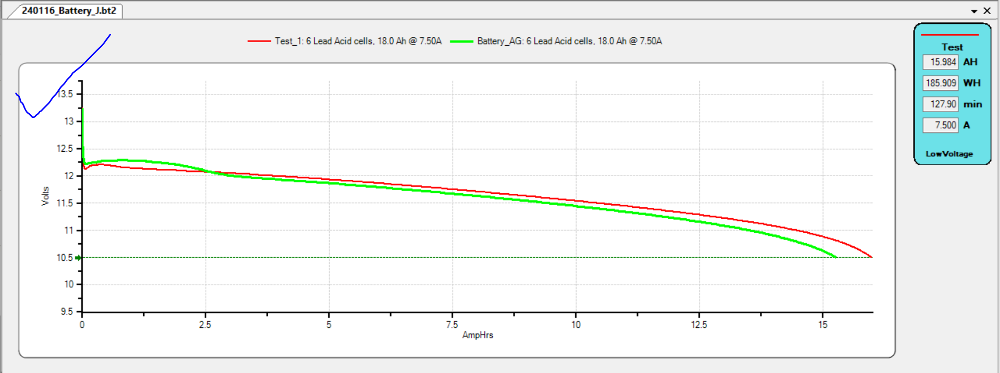
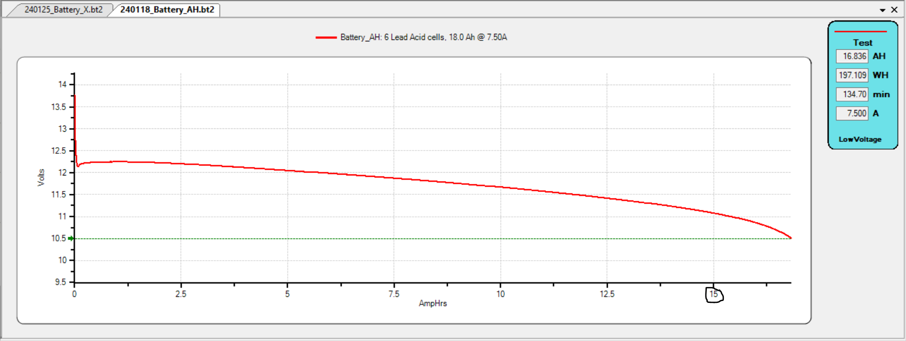
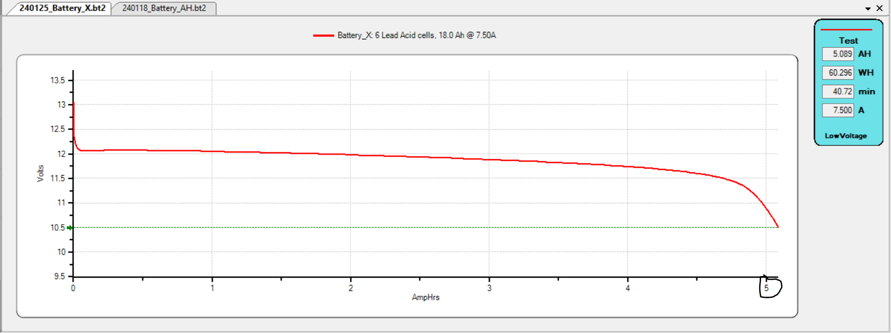
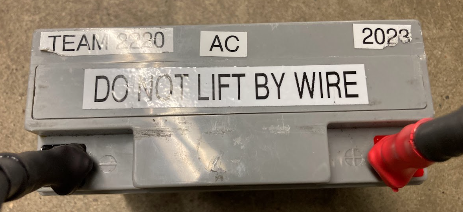

# Steps To Testing Batteries
 1. Check that the batteries you are testing are fully charged (VERY IMPORTANT!)

 2. Plug in the battery to the laptop
 
 3. Enter in the values below into Discharge

 

 4. In the file name space keep the date and after that put Battery_(battery name/letter) and do the same for the test name (shown on example)

 5. Then press start and wait until the test is done

 6. It should auto save to files if it didnt then go to file-save as... then look for in files and move it to Github-Batteries

 7. Then go to Github desktop-commit to main and push

 8. you are done! If you want to see your test data or any other test you just have to pull and go to the battery folder and it should be there and all of the other tests
 # Extra links
  ## link to battery analyzer  https://www.andymark.com/products/computerized-battery-analyzer
  ## more info https://team1640.com/wiki/index.php/
  Battery_Management#Battery_Testing

 # Installation instructions
 1. download CBA (Five) software from this link: https://www.westmountainradio.com/content.php?page=wmr-downloads#cba_dl

 2. Then run the CBA installer

 3. Download github desktop from this link: https://desktop.github.com/ (This is how you can save the test results so you can review them later)

 4. Then run the github desktop installer

 5. Then clone this reprository (So you can see all our past tests, if you already had done tests on another laptop)
 
 # How to view multiple tests at once
1. Open a test by hitting file->open->test you want
 
  2. Then go to chart->overlay->second test you want

 3. You are done (when you close it if you hit save it will save it to the file you opened)

# Laptop Setup 

1. Make sure the laptop is plugged in
2. Go to Windows settings > Power & sleep > screen, sleep
3. Under Plugged In, change make my device sleep after to "5 hours"
4. Under On Battery, change make my device sleep after to "5 hours"

# Good and Bad batteries

Good Battery

Bad Batttery

# How To Label Batteries

1. Sticker on upper left that says "TEAM 2220"

2. In the upper middle have a sticker that says the battery id (example: AC)

3. In upper right have sticker with year that the battery was recieved

4. In the very middle have a sticker that says "DO NOT LIFT BY WIRE"

fully labeled battery
